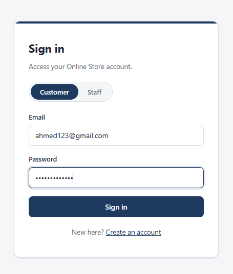
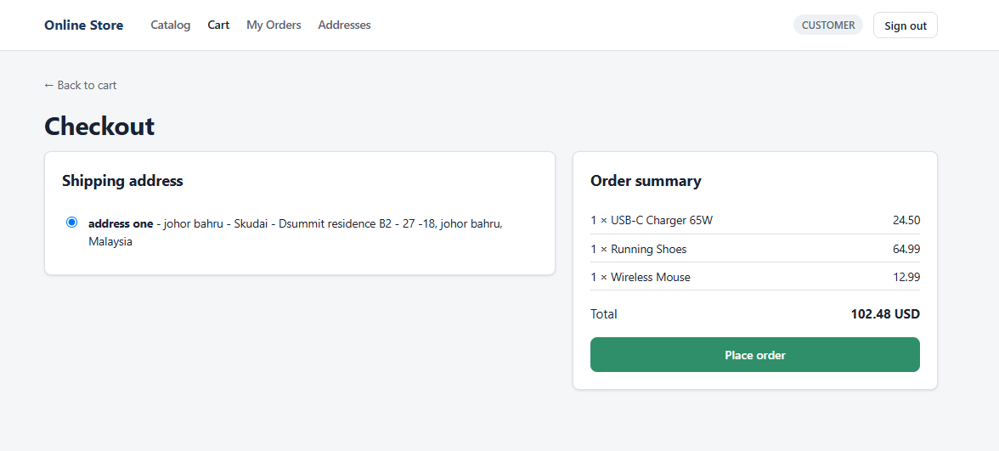
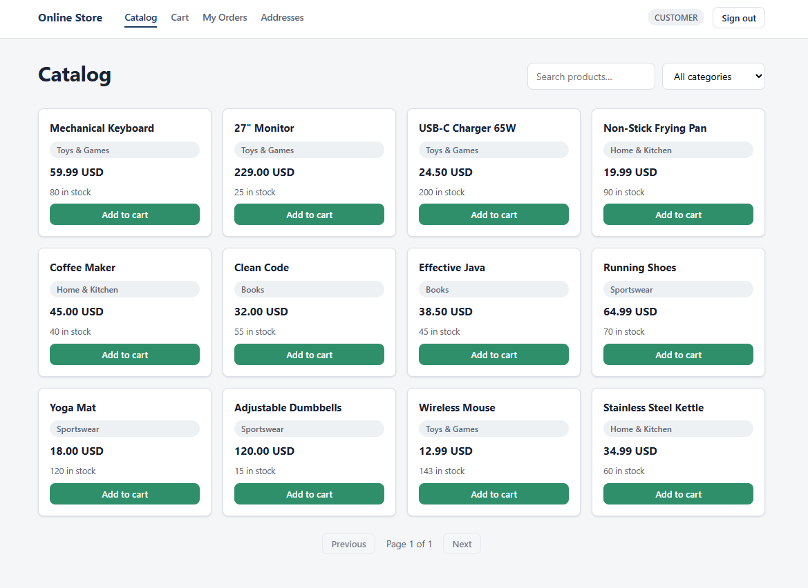
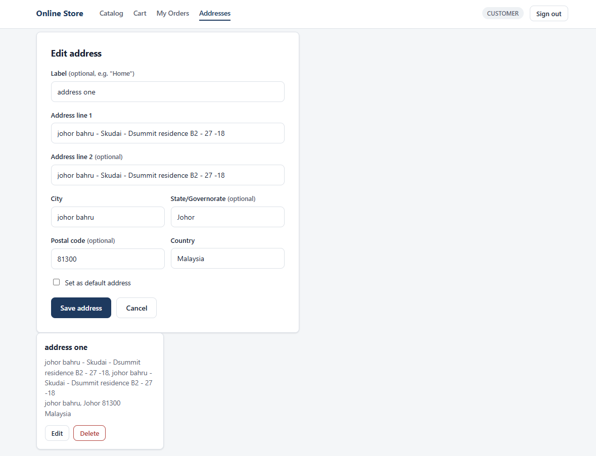
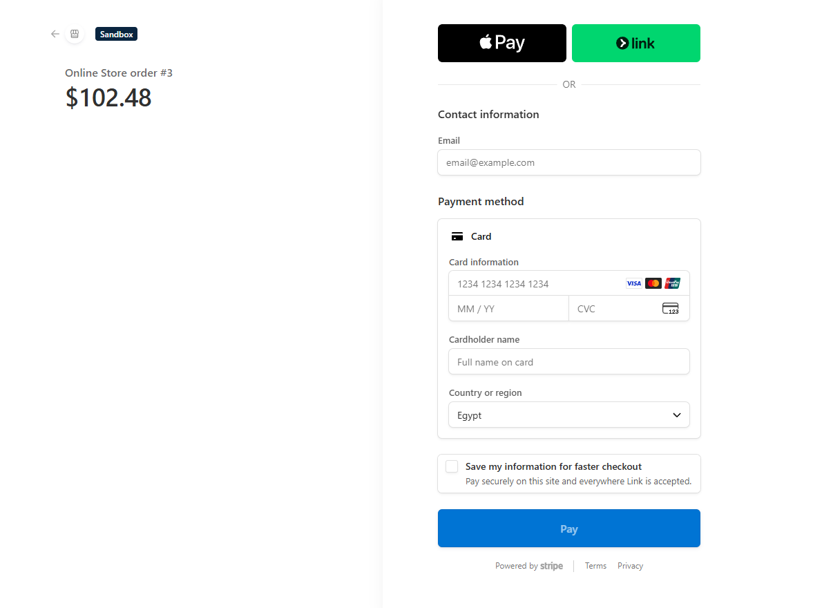
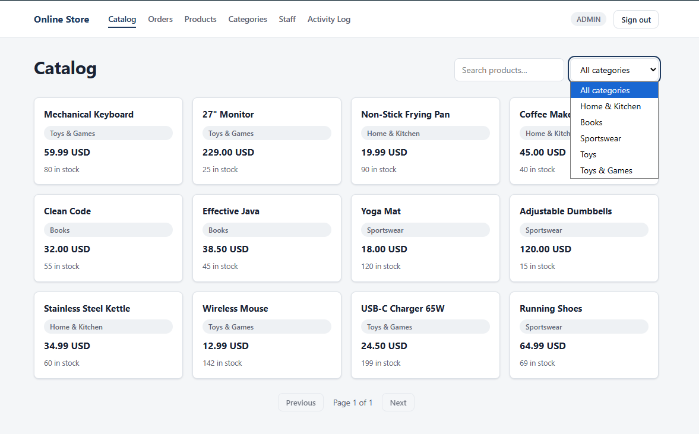

# Online Store - Code81 Assessment

A full-stack online store: Java 21 / Spring Boot backend, Angular 19 frontend, PostgreSQL, JWT auth, Stripe payment simulation.

here is the link for my ERD : https://drive.google.com/file/d/1GDceZDP5mM_BDBtqEC7ofdjKDL_aDBFu/view?usp=sharing
OPEN IT USING draw.io

## Screenshots

**Login**



**checkout**


**Home (post-login landing page)**


**address**


**payment**


**admin**


## Tech stack

| Layer        | Tech                                                                                    |
| ------------ | --------------------------------------------------------------------------------------- |
| Backend      | Java 21, Spring Boot 3.5, Spring Security + JWT, PostgreSQL, Flyway, Stripe (test mode) |
| Frontend     | Angular 19, standalone components, Reactive Forms, signals                              |
| Docs/testing | Swagger UI, Postman collection, draw.io ERD                                             |

## Repo structure

```
.
├── README.md                  <- you are here
├── screenshots/                <- project pictures
├── online-store-api/           <- backend (Spring Boot)
│   ├── README.md
│   ├── postman/
│   └── src/
└── online-store-angular/      <- frontend (Angular)
    ├── README.md
    └── src/
```

## Running it locally

You need both the backend and frontend running at the same time - the frontend expects the API at `http://localhost:8080`.

### 1. Backend

```bash
cd online-store-api

# one-time: create your local config from the template
cp src/main/resources/application.yml.example src/main/resources/application.yml
# then edit application.yml with your local Postgres credentials, a JWT secret,
# and (only needed for the payment flow) Stripe test keys

mvn spring-boot:run
```

Runs on `http://localhost:8080`. Flyway creates the schema and seed data automatically on first startup - see `online-store-api/README.md` for seed account credentials and Stripe webhook testing steps.

### 2. Frontend

```bash
cd online-store-frontend
npm install
ng serve
```

Runs on `http://localhost:4200`.

### 3. Try it

Open `http://localhost:4200` in a browser - you'll land on the login page. Use either the seeded admin account or the seeded demo customer account (both documented in `online-store-api/README.md`) to sign in.

## API docs & testing tools

- **Swagger UI:** `http://localhost:8080/swagger-ui.html` (backend must be running)
- **Postman collection:** `online-store-api/postman/online-store-full.postman_collection.json`
- **ERD:** `online-store-erd.drawio` - open at [app.diagrams.net](https://app.diagrams.net)

## Status

Backend: complete (catalog, auth, customers, cart & orders, staff/admin, activity logging, Stripe payment simulation).
Frontend: in progress - auth (login/register) done, catalog/cart/orders/staff screens next.
